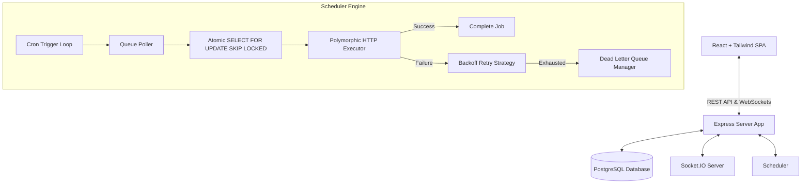

# Nova Distributed Job Scheduler 🚀

Nova-Scheduler is a production-inspired, highly-resilient, distributed background job scheduling platform designed to handle asynchronous tasks concurrently across a scalable worker pool. It implements atomic job claiming, configurable backoff retry strategies, circuit breakers for fault tolerance, and a real-time monitoring dashboard.

---

## 🏗️ Architectural Design

Nova-Scheduler is designed with a modern **Layered Service-Oriented Architecture**:



### Core Components

1. **Atomic Concurrency Engine**: Uses PostgreSQL's transaction locks (`SELECT FOR UPDATE SKIP LOCKED`) to claim jobs atomically, allowing safe horizontal scaling of workers without double-execution.
2. **Reliability Engine**: 
   - **Retry Strategies**: Supports `FIXED`, `LINEAR`, and `EXPONENTIAL` backoffs with randomized jitter to prevent the "thundering herd" effect on downstream services.
   - **Circuit Breaker**: Implemented with state transitions (`CLOSED`, `OPEN`, `HALF_OPEN`) to halt processing on queues targeting unstable services, protecting downstream systems from overload.
3. **Dead Letter Queue (DLQ)**: Automatically catches jobs that exhaust all configured retry attempts, letting developers inspect logs and errors, and trigger manual retries.
4. **Real-time Monitoring Layer**: Uses WebSockets (Socket.IO) to push live status transitions, queue sizes, and worker heartbeats instantly to the React frontend dashboard.

---

## 🗄️ Database Design

The relational database uses **Prisma ORM** with a highly normalized schema consisting of 12 tables:

- **Authentication & Multi-Tenancy**: `users`, `organizations`, `projects`.
- **Scheduling Pipelines**: `queues` (with custom configurations and relations to `retry_policies`).
- **Core Jobs & Executions**: `jobs` (payload data, state machine flags, locks), `job_executions` (audit trails for every attempt), `job_logs` (worker console output), `scheduled_jobs` (recurring cron states).
- **Worker Management**: `workers` (hostname, status, concurrency limits) and `worker_heartbeats` (CPU & Memory utilization telemetry).
- **Reliability Logging**: `dead_letter_queue` (inspections, errors, payloads).

---

## 🛠️ Step-by-Step Installation & Setup

Follow these steps to configure, migrate, and start both projects:

### 1. Database Configuration
Make sure your local PostgreSQL database is running. Update your connection credentials in `server/.env`:
```env
# server/.env
DATABASE_URL="postgresql://<username>:<password>@localhost:5432/nova_scheduler?schema=public"
```

### 2. Install Project Dependencies
Run the installation command in the root folder (installs both frontend client and server dependencies):
```bash
npm run install:all
```

### 3. Apply Schema and Seed Data
Create database schemas, run migrations, and inject rich mock seed data (pre-populating organizations, projects, queues with retry policies, immediate/recurring/batch jobs, worker logs, and DLQ entries):
```bash
cd server
npx prisma db push
npm run db:seed
cd ..
```

### 4. Run Server & Client Concurrently
Start the Express server and Vite React client simultaneously with a single command from the root folder:
```bash
npm run dev
```

The system will boot up:
- **Frontend Dashboard**: [http://localhost:5173](http://localhost:5173)
- **REST API Endpoint**: [http://localhost:3000/api/v1](http://localhost:3000/api/v1)
- **API Swagger Documentation**: [http://localhost:3000/api-docs](http://localhost:3000/api-docs)

---

## 🧪 Running Tests
We use Jest and Supertest to validate authentication, job triggers, and retry/circuit-breaker logic:
```bash
cd server
npm run test
```
