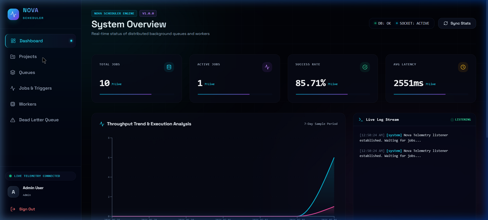
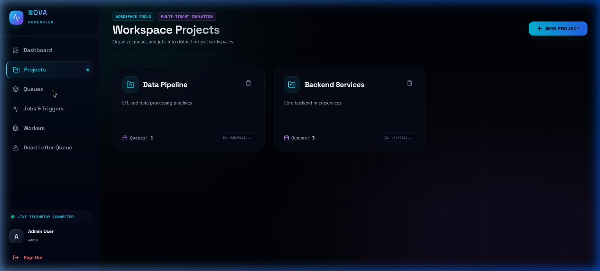
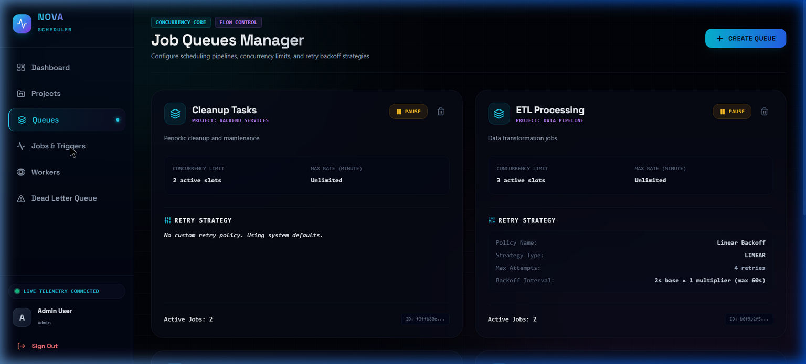
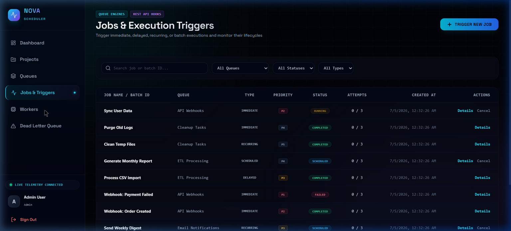
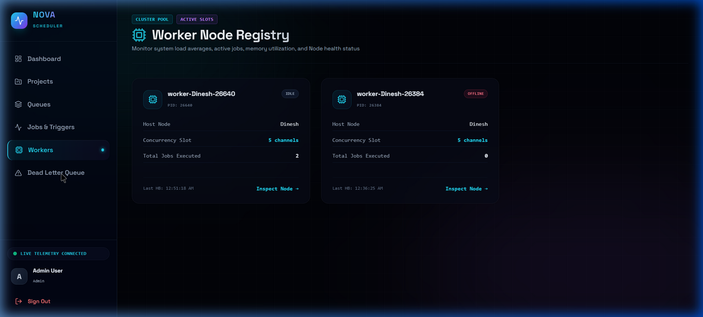
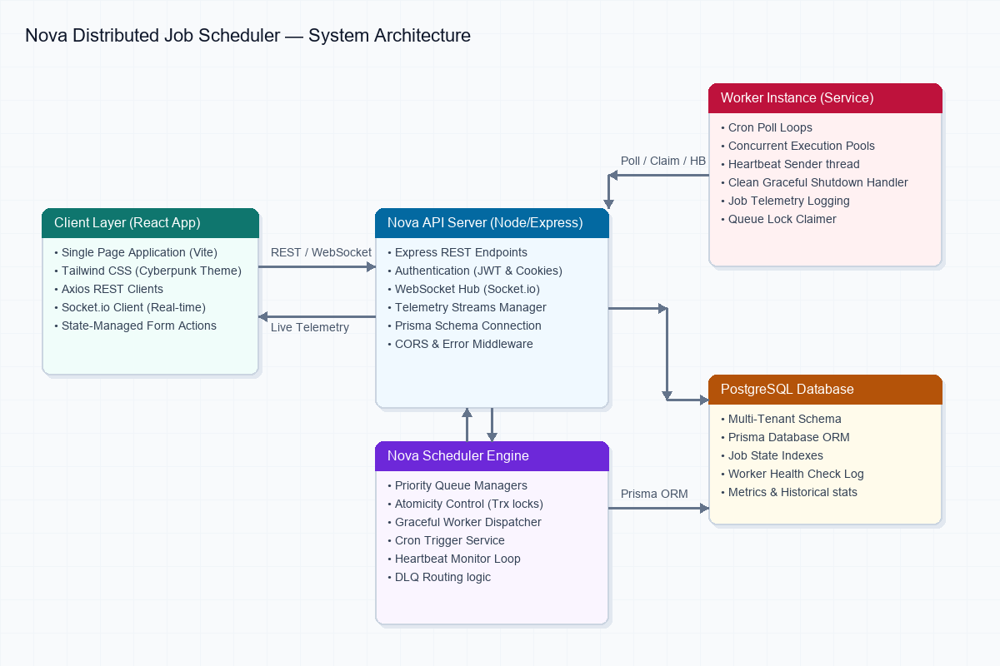
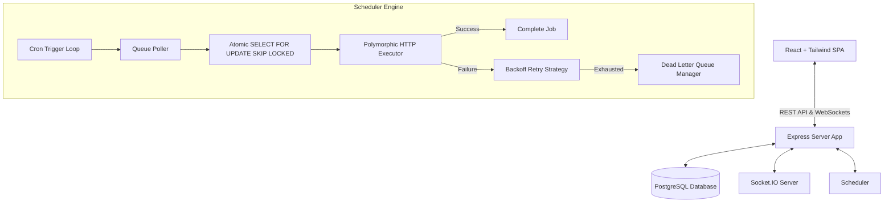
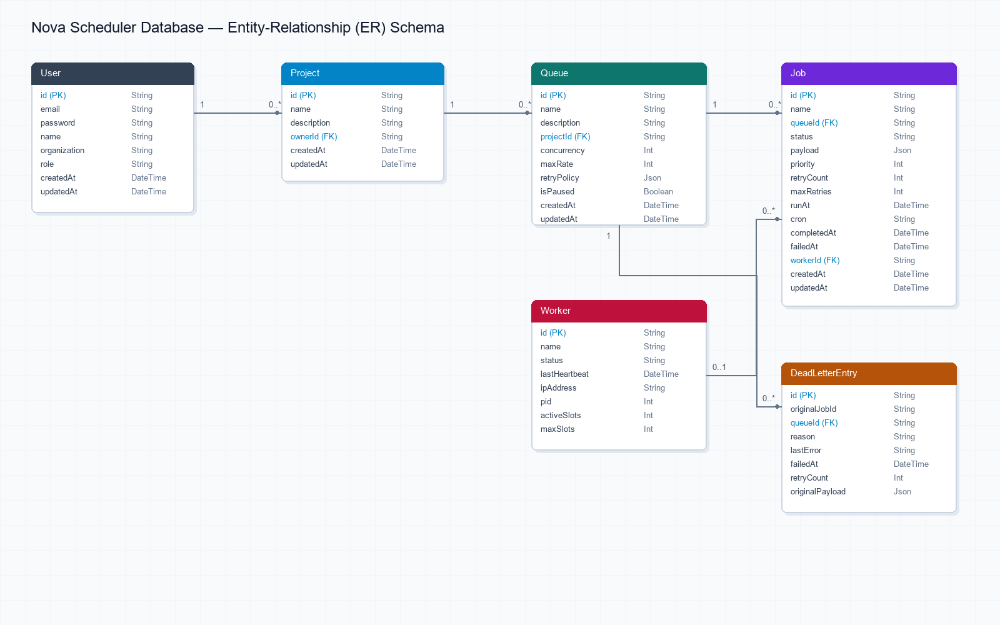

# 🪐 Nova Distributed Job Scheduler & Control Plane

[]()
[]()
[]()
[]()
[]()
[]()

Nova is an enterprise-grade, highly-resilient, multi-tenant distributed background job scheduler. Built from the ground up to orchestrate complex background actions across highly scalable worker nodes, Nova balances execution guarantees, database consistency, and high-fidelity operational diagnostics.

Featuring a redesigned **premium cyberpunk UI**, Nova integrates real-time WebSockets, glassmorphic analytics tabs, custom retry systems, and circuit-breaker telemetry monitors.

---

## 🎨 High-Fidelity UI Showcase

The Nova client management dashboard uses a custom cyberpunk theme (`glass`, `bg-mesh`, `glow-primary`) powered by Tailwind and Lucide icon telemetry.

### 1. Operations Dashboard
Real-time task counters, throughput charts, and live log stream output.


### 2. Multi-Tenant Project Spaces
Segment job queues and telemetry logs into isolated workspaces.


### 3. Queue Configurator & Flow Controllers
Configure concurrency limits, rate limit caps, and linear/exponential retry backoffs with a single click.


### 4. Job Triggers & Life-Cycle Tables
Search, filter, and track jobs from `QUEUED` → `CLAIMED` → `RUNNING` → `COMPLETED`.


### 5. Worker Clusters Registry
Track active worker nodes, slot consumption stats, IP addresses, and CPU heartbeats.


---

## 🏗️ Architecture Design & Topologies

Nova is designed with a **Layered Service-Oriented Architecture (SOA)**, separating frontend telemetry portals, backend coordinators, database tables, and distributed worker nodes.

### System Diagram




### Core Architecture Pillars

1. **Atomic Lock Concurrency Control**: Worker nodes poll for jobs using PostgreSQL transaction locks (`SELECT ... FOR UPDATE SKIP LOCKED`). This guarantees that no two workers can claim or run the same job concurrently, allowing infinite horizontal scaling.
2. **State Heartbeat Registry**: Workers send periodic health telemetry to the server. If a worker goes offline during a job execution, the monitor loop automatically detects the missing heartbeat, aborts the worker state, and releases the orphaned job back into the queue.
3. **Resilience & Backoffs**: Custom retry strategies (`FIXED`, `LINEAR`, `EXPONENTIAL`) with randomized jitter prevent retry storms (thundering herd effect) on downstream microservices.
4. **Circuit Breakers**: Monitors queue execution failures. If error rates exceed threshold targets, the breaker transitions to `OPEN` state, immediately pausing the queue execution to protect unstable APIs.

---

## 🗄️ Database Design & Entity Relationships

The relational database is configured via **Prisma ORM** with indexes on hot path columns (`status`, `runAt`, `queueId`, `workerId`).

### Entity-Relationship Diagram (ERD)


### Core Models Schema

| Model | Primary Keys / Foreign Keys | Description |
| :--- | :--- | :--- |
| **User** | `id` (PK) | Credentials, email validation, and role properties. |
| **Project** | `id` (PK), `ownerId` (FK) | Multi-tenant namespace containing distinct sets of queues. |
| **Queue** | `id` (PK), `projectId` (FK) | Configures concurrency locks, max rate limits, and active pauses. |
| **Job** | `id` (PK), `queueId` (FK), `workerId` (FK) | Contains execution payload, priority scores, schedules, and retries. |
| **Worker** | `id` (PK) | Tracking node parameters, system load, active slots, and heartbeat timestamps. |
| **DeadLetterEntry** | `id` (PK), `queueId` (FK) | Captures permanently failed job payloads and full system stack traces. |

---

## 🔌 API Endpoint Reference

Nova exposes a fully-documented REST API for job submittal, workspace controls, and queue diagnostics.

### Authentication & Management
* `POST /api/auth/register` - Create a new user namespace and organization.
* `POST /api/auth/login` - Authenticate user session.
* `POST /api/auth/logout` - Clear cookies and terminate session.

### Workspace Projects
* `GET /api/projects` - List all projects in the tenant namespace.
* `POST /api/projects` - Create a new project workspace.

### Queues Control
* `GET /api/queues` - List queues and operational statistics.
* `POST /api/queues` - Create new execution queue.
* `POST /api/queues/:id/pause` - Temporarily pause queue execution.
* `POST /api/queues/:id/resume` - Resume queue execution.

### Jobs Orchestration
* `POST /api/jobs` - Enqueue a job. Supports:
  * **Immediate**: executes as soon as worker is free.
  * **Delayed**: schedules execution after `runAt` offset.
  * **Recurring**: cron expression string (e.g. `*/5 * * * *`).
* `POST /api/jobs/:id/retry` - Manually resubmit a failed job from the Dead Letter Queue.
* `DELETE /api/jobs/:id` - Cancel and delete a job.

---

## ⚙️ Step-by-Step Installation & Run Guide

### Prerequisites
* **Node.js** >= 18.x
* **PostgreSQL** >= 15.x
* **Prisma CLI** (npx)

### 1. Environment Setup
Create a `.env` file inside the `server/` directory and configure your PostgreSQL connection string:
```env
# server/.env
DATABASE_URL="postgresql://postgres:<password>@localhost:5432/nova_scheduler?schema=public"
JWT_SECRET="your-super-secret-jwt-key"
PORT=3000
```

### 2. Install Project Packages
From the root directory, run the workspace command to install dependencies for both client and server:
```bash
npm run install:all
```

### 3. Initialize Database Tables & Seed data
Migrate the database tables and populate the PostgreSQL schema with default seed configurations (organizations, projects, sample job queues, default admin credentials, and logs):
```bash
# Navigate to server folder
cd server

# Push Prisma schemas
npx prisma db push

# Run seed commands
npm run db:seed

# Return to root directory
cd ..
```

### 4. Start Development Cluster
Run the concurrent development servers (API server and Vite React client) using a single command:
```bash
npm run dev
```

* **Client Control Dashboard**: [http://localhost:5173](http://localhost:5173)
* **Backend Coordinator Server**: [http://localhost:3000](http://localhost:3000)

**Default Login Credentials:**
* **Admin**: `admin@nova.dev` / `admin123`
* **Member**: `member@nova.dev` / `member123`

---

## 🧪 Testing
Nova contains unit and integration tests using **Jest** and **Supertest** to validate auth, locks, retry loops, and worker claim loops.

To run tests:
```bash
cd server
npm run test
```

---

## 📄 License
This project is licensed under the MIT License - see the [LICENSE](LICENSE) file for details.
